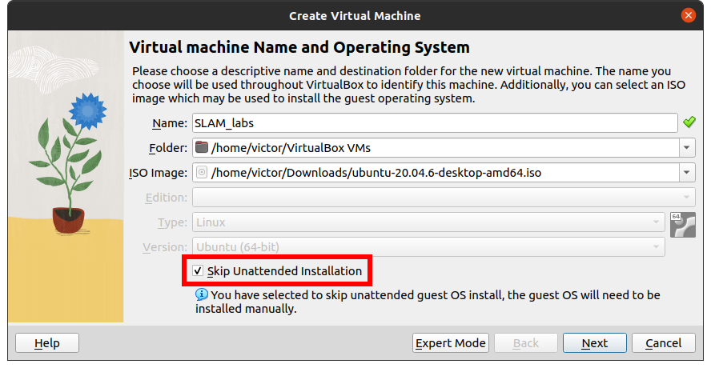
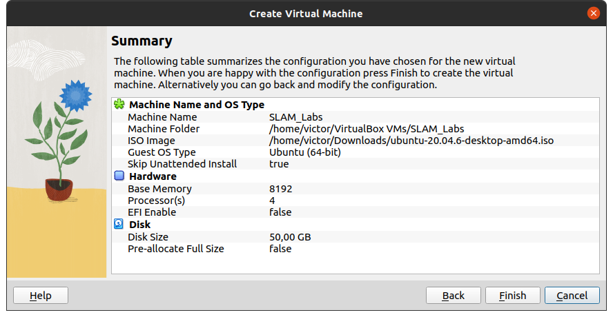

# Lab #0: Setting up the environment for SLAM labs

## Install Ubuntu 20.04.6 (Focal)
Download link: https://releases.ubuntu.com/focal/

- **Minimal requirements:** 2 CPU / 4GB RAM / ~25GB HDD
- **Recommended:** 4 CPU / 8GB RAM / ~50GB HDD

> [!WARNING]
> If you do not have enough resources on your computer, it may freeze.

> [!NOTE]
> You can use a different operating system at your own risk.
> But sometimes the best option is to work in a virtual machine.

> [!TIP]
> If you use VirtualBox, check "Skip unattended installation".





## Install build dependencies
- build-essential (includes g++, gcc, make…)
- Cmake
- OpenGL
- SuiteSparse
- Eigen3

````sh
sudo apt install build-essential cmake mesa-common-dev freeglut3-dev \   
  libsuitesparse-dev libeigen3-dev
````

### Download “Mini-SLAM” and unzip the folder

````sh
unzip Mini-SLAM.zip
cd Mini-SLAM
````

## Build OpenCV (version 4.x)

> [!NOTE]
> Skip this step if you already have OpenCV 4.0 or later installed on your computer.

````sh
cd Thirdparty/OpenCV
# Install minimal prerequisites
sudo apt update && sudo apt install -y cmake g++ wget unzip
# Install other useful dependencies
sudo apt install libjpeg-dev libpng-dev libtiff-dev libavcodec-dev \
  libavformat-dev libswscale-dev libv4l-dev libxvidcore-dev \
  libx264-dev libgtk-3-dev libatlas-base-dev gfortran
# Download and unpack sources
wget -O opencv.zip https://github.com/opencv/opencv/archive/4.9.0.zip
wget -O opencv_contrib.zip \
  https://github.com/opencv/opencv_contrib/archive/4.9.0.zip
unzip opencv.zip && rm opencv.zip
unzip opencv_contrib.zip && rm opencv_contrib.zip
# Create build directory and switch into it
mkdir -p build && cd build
# Configure
cmake -DOPENCV_EXTRA_MODULES_PATH=../opencv_contrib-4.9.0/modules \
  ../opencv-4.9.0
# Build
cmake --build .
````

### Install OpenCV system-wide

> [!NOTE]
> This step is optional. The provided CMake project is configured to use the local build of OpenCV 4.x inside the _Thirdparty_ folder.
> However, if you do not have any previous version in your computer you may consider a system-wide installation.

This command will copy the new OpenCV binaries to `/usr/local` so that you can use this library in future projects without having to build it again:

````sh
# Install
sudo make install
````

## Run the code

Then, we will test that everything is set up by compiling the Lab #0 code:

````sh
./build_thirdparty.sh
./build_Lab0.sh
````

Binary files should have been generated inside the `Lab0/Apps` folder:

````sh
./Lab0/Apps/task_1
./Lab0/Apps/task_2
./Lab0/Apps/task_3
````

### Complete the assignment tasks

Now follow the "Readme for Lab #0" and complete the tasks to familiarize yourself with some of the libraries that will be used in Labs #3 and #4.

## Prepare for the next labs

Finally, prepare the last requirement for Labs #3 and #4:
### Pangolin [(link)](https://github.com/stevenlovegrove/Pangolin)
````sh
cd Thirdparty
git clone --recursive https://github.com/stevenlovegrove/Pangolin.git
cd Pangolin
./scripts/install_prerequisites.sh required
cmake -B build
cmake --build build
````